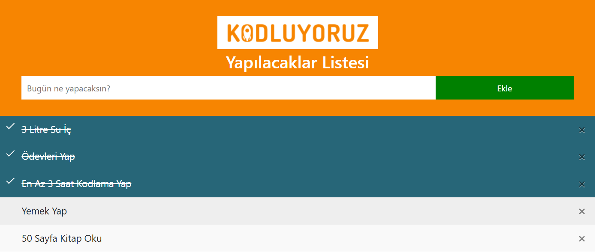

# JavaScript Basic To Do List


### You can easily plan your to dos and when you finish your work, you can mark it as done. Don't afraid, when you refresh the page. Your to dos don't disappear.



## Installation
Clone the project with the code below [Repo-link](https://github.com/meliketekin/JSToDoList)

```
git clone https://github.com/meliketekin/JSToDoList
```